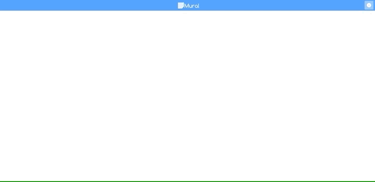

# Mural Notes
[](https://travis-ci.com/davidfigueroar9/mural) [](https://coveralls.io/github/davidfigueroar9/mural?branch=master) [](https://github.com/davidfigueroar9/mural/blob/master/LICENSE)

A mini-mural app with sticky notes, which allows you to create notes, edit, delete and move them.

### Online Demo

The demo is hosted in netlify service.

[mural-notes](https://mural-notes.netlify.com/)

<p align="center">
    
</p>


### Installation

To install the application follow the steps below in the console, you need to have installed nodejs, git and yarn.

Download repo:
```sh
git clone https://github.com/davidfigueroar9/mural.git
```

Change to directory:
```sh
cd mural
```

Install dependencies:
```sh
yarn install
```

Run App:
```sh
yarn start
```

### How to use it?

- Add note: <code>Double click</code>

- Edit note: <code>Double click</code>

- Select Note: <code>Click</code>

- Select multiple: <code>Shift + click</code>

- Copy: <code>Ctrl + C</code>

- Paste: <code>Ctrl + V</code>

### Poll

#### What Javascript frameworks are you familiar with?
Angular 1.x, ReactJs, React Native, VueJs, SailsJs and ExpressJs.

#### Did you work with any of these technologies?

- SVG
- WebWorkers
- WebSockets
- Offline (AppCache)

I have worked with WebSockets, SVG and localStorage.

#### What other languages have you programmed with? Which ones professionally?

I have worked professionally with framework Laravel(PHP).

#### What is your favorite text editor?

Atom.

#### Did you work with DBs? Which one(s)?

Yes, I have worked with Mysql, Postgres and Mongodb.

#### What HTTP methods are you familiar with?

I'm familiar with the methods GET, POST, PACTH, PUT and DELETE.
